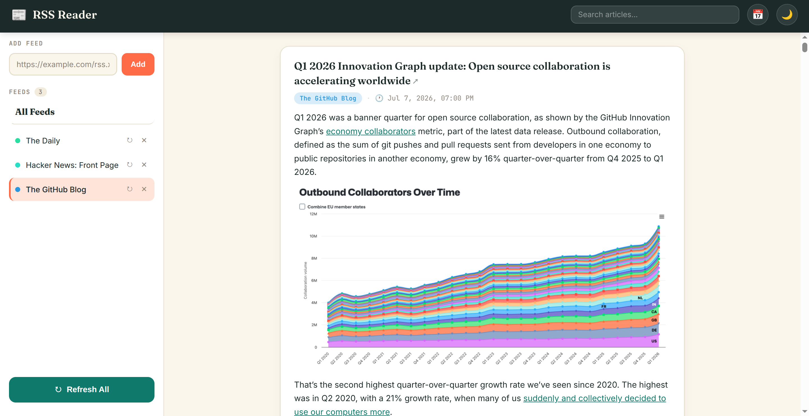
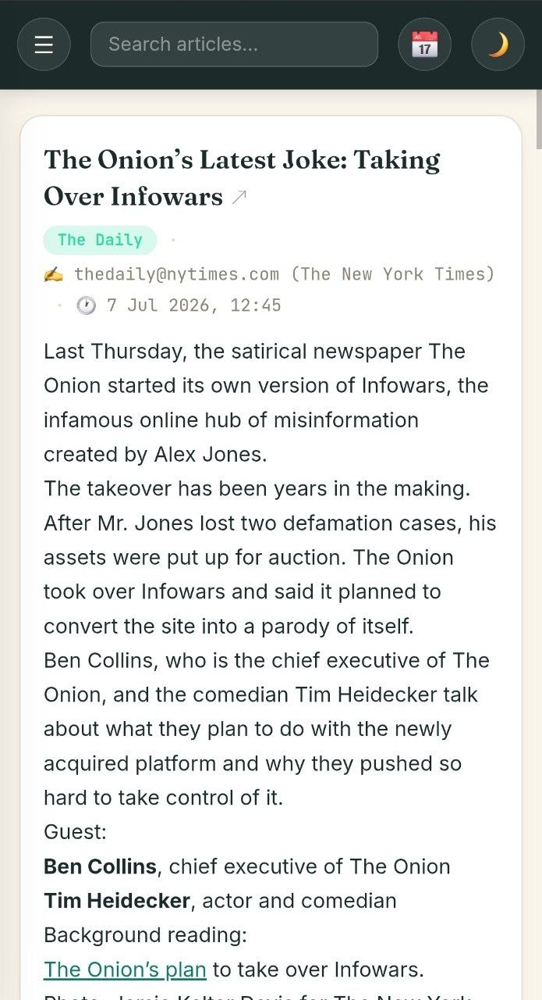
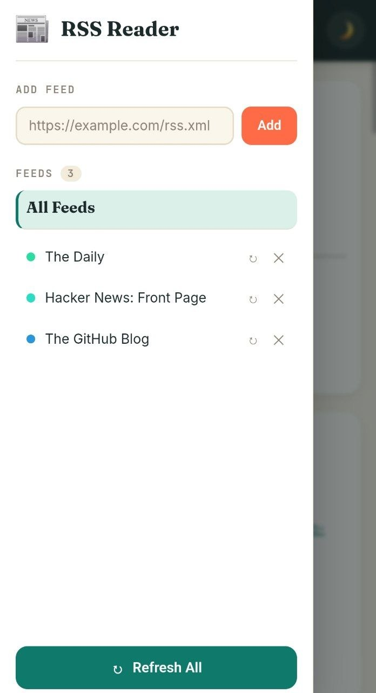

# RSS Reader

A lightweight, self-hosted RSS/Atom feed reader built with ASP.NET Core Minimal API. Aggregates articles from your favorite websites into a clean, distraction-free reading experience with dark mode, search, and date filtering.

**[Live Demo](https://deb-rss-reader-production.up.railway.app/)**

## Architecture


## Screenshots

| Desktop | Phone | Phone Sidebar |
|---------|-------|---------------|
|  |  |  |

## Tech Stack

| Layer | Technology |
|-------|-----------|
| **Backend** | ASP.NET Core 10 Minimal API |
| **Feed parsing** | [CodeHollow.FeedReader](https://github.com/arminreiter/FeedReader) (RSS 0.91–2.0, Atom) |
| **XSS prevention** | [HtmlSanitizer](https://github.com/mganss/HtmlSanitizer) |
| **Storage** | Single JSON file (`data/subscriptions.json`) |
| **Frontend** | Vanilla HTML/CSS/JS, no frameworks |
| **Fonts** | Fraunces, Inter, JetBrains Mono (Google Fonts) |
| **Hosting** | [Railway](https://railway.app) |

## Features

- **Feed management** — add, remove, and refresh individual feeds
- **River of news** — articles from all feeds in reverse chronological order
- **Multi-feed selection** — filter articles by one or more feeds
- **Full-text search** — search article titles and content with debounced input
- **Date range filter** — filter articles by publication date (from/to)
- **Pagination** — page through articles with Previous/Next controls
- **Dark / Light mode** — persisted to `localStorage`
- **Responsive** — sidebar drawer on mobile, fixed sidebar on desktop
- **XSS-safe** — server-side HTML sanitization before storage

## API Endpoints

| Method | Route | Description |
|--------|-------|-------------|
| `GET` | `/feeds` | List all subscribed feeds |
| `POST` | `/feeds?url=...` | Add a new feed (validates URL is RSS/Atom) |
| `DELETE` | `/feeds/{id}` | Remove a feed and its articles |
| `POST` | `/feeds/{id}/refresh` | Fetch latest articles from a specific feed |
| `POST` | `/feeds/refresh-all` | Refresh all feeds |
| `GET` | `/articles?page=&pageSize=&feedIds=&q=&dateFrom=&dateTo=` | Paginated, filterable article list |

## Project Structure

```
├── Program.cs                # API endpoints (Minimal API)
├── RssReader.Api.csproj      # Project file (.NET 10)
├── Models/
│   ├── Article.cs            # Article model
│   ├── Feed.cs               # Feed model
│   └── SubscriptionStore.cs  # Root JSON model (Feeds + Articles)
├── Services/
│   ├── FeedService.cs        # Feed validation, parsing, sanitization
│   └── StorageService.cs     # JSON file read/write, query logic
├── data/
│   └── subscriptions.json    # Persistent data file
├── wwwroot/
    └── index.html            # Frontend (single-file SPA)
```

## Getting Started

```bash
# Clone
git clone https://github.com/your-username/rss-reader.git
cd rss-reader

# Run
dotnet run

# Open
open http://localhost:5020
```

## Deployment

Deployed on [Railway](https://railway.app) with zero configuration.

```
https://rss-reader-production-ec37.up.railway.app/
```
